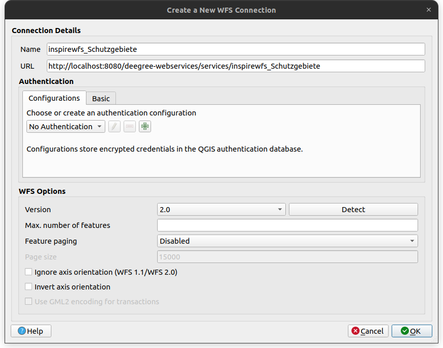
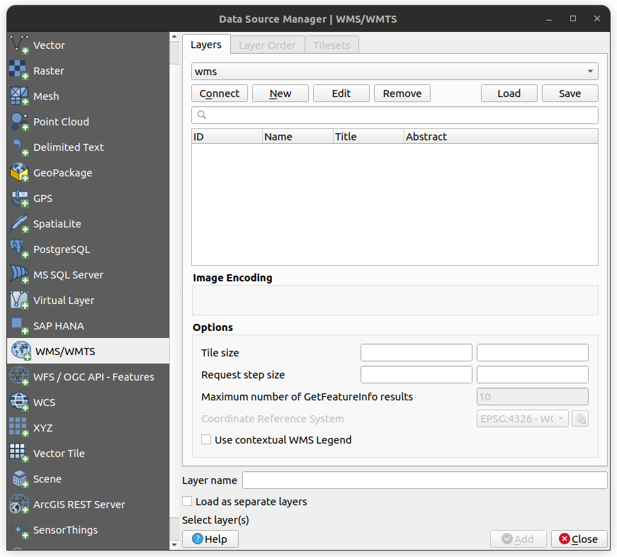
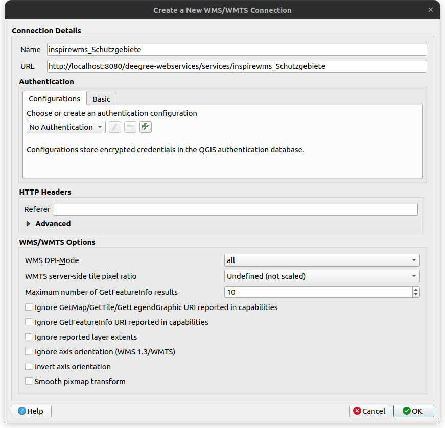

# Quickstart Tutorial "INSPIRE Network Services with deegree 3.5 on Docker" (90 minutes)

[Online-Version (GitHub)](https://github.com/lat-lon/deegree-workshop/blob/main/README.md)

## Agenda   

1. [Setup the Docker Compose infrastructure](#setlink)

2. [Configure INSPIRE Direct Access Download Services based on deegree WFS 2.0](#setlink)

3. [Import test data using deegree WFS-T interface](#setlink)

4. [Retrieve data with different clients](#setlink)

5. [Validate service and data](#setlink)

---

## 1. Setup the Docker infrastructure


### 1.1 Install Docker

> **Info**: "Docker Desktop provides a user-friendly graphical interface that simplifies the management of containers and services. It includes Docker Engine as this is the core technology that powers Docker containers. Docker Desktop for Linux also comes with additional features like Docker Scout and Docker Extensions" [(Docker Inc. 2024)](https://docs.docker.com/desktop/install/linux-install/).

#### Docker Desktop
 
* [Linux](https://docs.docker.com/desktop/install/linux-install/) (recommended)
* [Windows](https://docs.docker.com/desktop/install/windows-install/)
* [Mac](https://docs.docker.com/desktop/install/mac-install/)

#### Docker Engine

* [Linux](https://docs.docker.com/engine/install/) (advanced)

### 1.2 Pull the desired Docker Image versions of deegree, PostgreSQL/PostGIS and pgAdmin4 (optional)

#### PostgreSQL/PostGIS Database
 

* Docker Hub: [https://hub.docker.com/r/postgis/postgis/](https://hub.docker.com/r/postgis/postgis/)

To download the Docker image from the Docker registry run:

    docker pull postgis/postgis:16-3.4

#### pgAdmin 4 Web Interface

* Docker Hub: [https://hub.docker.com/r/dpage/pgadmin4/](https://hub.docker.com/r/dpage/pgadmin4/)

To download the Docker image from the Docker registry run:

    docker pull dpage/pgadmin4:8.9

#### deegree Webservices


* Docker Hub: [https://hub.docker.com/r/deegree/deegree3-docker/](https://hub.docker.com/r/deegree/deegree3-docker/)

To download the Docker image from the Docker registry run:

    docker pull deegree/deegree3-docker:3.5.8

* Dockerfile available under: [https://github.com/deegree/deegree3-docker](https://github.com/deegree/deegree3-docker)

## 1.3 Setting up your Docker Environment for deegree

For this tutorial, all necessary configuration files and data required to set up and run an example INSPIRE ProtectedSites deegree workspace are available for download in as [ZIP-File](https://github.com/lat-lon/deegree-workshop/archive/refs/heads/main.zip).

For this tutorial, only the contents of the `/deegree-workshop-bundle` folder in the downloaded ZIP-File are relevant. The folder contains the following items:

| Directory       | Content                                                                                                                                                                                   | Documentation |
| :-------------- |:------------------------------------------------------------------------------------------------------------------------------------------------------------------------------------------| :------------ |   
| `/deegree-workspace/ps-sl`          | Complete deegree workspace with data and configuration files (WFS, WMS, layers, styles and database) for the INSPIRE Annex 1 data theme ProtectedSites from the federal state of Saarland | [What is a deegree workspace?](https://download.deegree.org/documentation/current/html/#_the_deegree_workspace) |
| `/sql`      | SQL scripts for setting up the PostgreSQL database                                                                                                                                        | [PostgreSQL](https://www.postgresql.org/docs/current/tutorial.html), [PostGIS](https://postgis.net/workshops/postgis-intro/) |
| `docker-compose.yaml`         | Docker Compose file for defining and running multi-container applications, in this case including deegree, PostgreSQL and pgAdmin 4                                                       | [How does Docker Compose work?](https://docs.docker.com/compose/compose-application-model/) | 
| `.env` | Used to set the necessery environment variables                                                                                                                                           | [How to use the `.env`?](https://docs.docker.com/compose/environment-variables/set-environment-variables/) |

### Overview of the Docker compose file
The provided, ready-to-use, Docker Compose file contains the following configuration (break down):

```
services:
  deegree:
    image: deegree/deegree3-docker:${DEEGREE_VERSION}
    container_name: deegree_${DEEGREE_VERSION}
    ports:
      - 8080:8080
    links:
      - postgres
    volumes:
      - ./deegree-workspace:/root/.deegree:rw
    depends_on:
      postgres:
        condition: service_started
    networks:
      - network
```
The first service declared in the Docker Compose file is deegree, which runs the deegree web services. 
The specific version of deegree used is determined by the DEEGREE_VERSION variable defined in the .env file. 
The service depends on the successful startup of the PostgreSQL service (referred to as postgres). 
Once PostgreSQL is running, the deegree service is started. The deegree container also mounts a local 
directory (./deegree-workspace) to /root/.deegree within the container, ensuring that the workspace 
configuration is persistent and shared.

```
  postgres:
    image: postgis/postgis:${POSTGRES_POSTGIS_VERSION}
    container_name: postgres_database
    ports:
      - 5432:5432
    environment:
      - POSTGRES_USER=postgres
      - POSTGRES_PASSWORD=postgres
    volumes:
      - ./sql:/docker-entrypoint-initdb.d/
    networks:
      - network
```
The second service is postgres, a PostgreSQL database with PostGIS extensions. 
The exact version is specified by the POSTGRES_POSTGIS_VERSION variable from the .env file. 
It exposes port 5432 and initializes the database using SQL scripts found in the ./sql directory, 
which are automatically executed at container startup.
```
  pgadmin:
    image: dpage/pgadmin4:${PGADMIN_VERSION}
    container_name: pgadmin_${PGADMIN_VERSION}
    ports:
      - 5080:80
    environment:
      - PGADMIN_DEFAULT_EMAIL=pgadmin4@pgadmin.org
      - PGADMIN_DEFAULT_PASSWORD=admin
    depends_on:
      postgres:
        condition: service_started
    networks:
      - network
```            
The third service, pgadmin, is the pgAdmin 4 web interface, used for managing the PostgreSQL database via a web browser. 
This service also waits for PostgreSQL to start before initializing. 
The version of pgAdmin is determined by the PGADMIN_VERSION variable in the .env file, 
and it exposes port 5080 for access.
```
networks:
  network:
    name: deegree_workshop
```
At last, a custom Docker network named deegree_workshop is created. 
This network ensures that all services can communicate within the same isolated network environment, 
allowing containers to reference each other by their service names.

>**Info:** You can find an overview of basic Docker Compose commands at the end of this tutorial under: [Overview of basic Docker Compose commands](#overview-of-basic-docker-commands). 

### Specifying version variables for services

The `.env` file included in the provided `/deegree-workshop-bundle` defines specific version variables for 
the services used in the Docker Compose setup. This file contains the following environment variables (breakdown):

```
DEEGREE_VERSION=3.5.8
```
This variable specifies the exact version of deegree to be used. The Docker Compose file references this 
variable to pull the corresponding deegree Docker image.

```
POSTGRES_POSTGIS_VERSION=16-3.4
```
This variable defines the version of PostgreSQL along with its PostGIS extensions. The Docker Compose file references 
this variable to pull the corresponding PostgreSQL/PostGIS Docker image.
```
PGADMIN_VERSION=8.9
```
This variable sets the version of pgAdmin 4 to be used. The Docker Compose file references
this variable to pull the corresponding pgAdmin 4 Docker image.

Using these version parameters in the `.env` file allows for easy updates and consistent configuration across 
different setups.

# 2. Import ProtecedSites data into the PostgreSQL database 

## 2.1 Use the deegree GmlLoader

In order to import GML data of the INSPIRE Annex 1 data theme ProtectedSites into the SqlFeatureStore of deegree, 
the `GmlLoader` of the deegree GML tools CLI is used. Since we are working with the Docker image of deegree, the CLI is 
already available under `/opt` in the deployed Docker container. Since the GML data is stored in the provided workspace and 
therefore also available on the Docker container, we can execute the `GmlLoader` with the one following commands.
Be sure to use the right container name, which can change depending on the configured `DEEGREE_VERSION` in the `.env`.

**One dataset**, 1317 polygon geometries, ~25min duration (recommended):
```
docker exec -w /opt deegree_[YOUR_DEEGREE_VERSION] java -Xmx16g -jar deegree-tools-gml.jar GmlLoader -pathToFile=/root/.deegree/ps-sl/data/gmlData/ProtectedSites_Naturschutz.gml -workspaceName=ps-sl -sqlFeatureStoreId=INSPIRE_ProtectedSites_WFS
```
**Two datasets**, 7 polygon and 3340 point geometries, ~2hours duration:
```
docker exec -w /opt deegree_[YOUR_DEEGREE_VERSION] java -Xmx16g -jar deegree-tools-gml.jar GmlLoader -pathToList=/root/.deegree/ps-sl/data/gmlData/gmldatalist.txt -workspaceName=ps-sl -sqlFeatureStoreId=INSPIRE_ProtectedSites_WFS
```

>**Info**: Setting the Java parameter `-Xmx16g` (value dependant on the resources provided) is highly advisable, to avoid
> a Java `OutOfMemoryError`. Further information regarding the parameters of the GmlLoader can be found in the 
> [deegree documentation of the GML tools CLI](https://download.deegree.org/documentation/current/html/#deegree-gml-tools).

Beware that the `GmlLoader` can only be executed when the used SqlFeatureStore in deegree was created using the
`SqlFeatureStoreConfigCreator`, which is also a part of the deegree GML tools CLI. Since the configuration for this
tutorial is provided, the usage of the `SqlFeatureStoreConfigCreator` is not necessary. 
## 2.2 Use the pgAdmin 4 Web Interface 

After the import of the GML data using the deegree `GmlLoader` is finished, we can verify the content of the PostgreSQL
database using the pgAdmin 4 web interface. To do so, open [http://localhost:5080/](http://localhost:5080/) in 
your browser and use the following credentials to login into pgAdmin 4:

* **User**: pgadmin4@pgadmin.org
* **Password**: admin

Next, add your database server under:
##### Object > Register > Server...

After navigating to the said point through the toolbar, a pop-up window opens. Fill the tabs General and Connection with
the given information below.

**General**:
* **Name**: inspire_ps_server

**Connection**:
* **Host name**: postgres_database
* **Port**: 5432
* **User**:	postgres
* **Password**: postgres

>**Info**: The password is `postgres`, since the set Docker environment variable for the service postgres in the Docker Compose file is `POSTGRES_PASSWORD=postgres`!

After connecting to the database server, you should see a database named `inspire` listed. If the GML data import was 
successful, the tables within the `schutgeb` schema will be populated with data. To visualize this data, expand 
the `inspire` database, then navigate to the `schutgeb` schema. Here, you'll find several tables that were created 
by the setup scripts executed during the Docker Compose environment initialization. To view the data, right-click 
on a table and select `View/Edit Data > All Rows`. This will run a predefined SQL query, displaying the data in 
the pgAdmin 4 web interface.

## 3. Use QGIS to visualize the data

### 3.1 Retrieve the WFS and WMS endpoints 

To retrieve the Web Feature Service (WFS) and Web Map Service (WMS) endpoints of the deegree workspace for the 
INSPIRE Annex 1 data theme ProtectedSites, navigate to the deegree web console with:
* http://localhost:8080/deegree-webservices

In the web console, go to the pre-configured web services under:

##### web services > services

If everything is set up correctly, you should see a WFS named `inspirewfs_Schutzgebiete` and a WMS 
named `inspirewms_Schutzgebiete`. By clicking the `Capabilities` button for each service, you can access 
the corresponding capabilities document in form of an XML response. This document provides metadata about the 
operations, services, and data offered by the service.

* WFS Capabilities: [http://localhost:8080/deegree-webservices/services/inspirewfs_Schutzgebiete?service=WFS&request=GetCapabilities](http://localhost:8080/deegree-webservices/services/inspirewfs_Schutzgebiete?service=WFS&request=GetCapabilities)
* WFS Capabilities: [http://localhost:8080/deegree-webservices/services/inspirewms_Schutzgebiete?service=WMS&request=GetCapabilities](http://localhost:8080/deegree-webservices/services/inspirewms_Schutzgebiete?service=WMS&request=GetCapabilities)

Based on the capabilities address, the endpoint for each service can be identified:

* WFS Endpoint: [http://localhost:8080/deegree-webservices/services/inspirewfs_Schutzgebiete](http://localhost:8080/deegree-webservices/services/inspirewfs_Schutzgebiete)
* WFS Endpoint: [http://localhost:8080/deegree-webservices/services/inspirewms_Schutzgebiete](http://localhost:8080/deegree-webservices/services/inspirewms_Schutzgebiete)

### 3.2 Launch QGIS

Launch QGIS on the device where your Docker Compose environment is set up.

If QGIS is not already installed, you can download the appropriate version for your operating system 
from [https://qgis.org/download/](https://qgis.org/download/) and follow the installation instructions.

> **Info**: You may also use other Geographic Information Systems (GIS) or similar software to visualize 
> your data, if preferred.

Once QGIS launched, create a new QGIS project with the Name `INSPIRE_PS`.

### 3.3 Add the WFS and WMS Endpoints to QGIS 

#### 3.3.1 Add the WFS Endpoint

Add a new WFS / OGC API - Features layer to your QGIS project under:

##### Layer > Add Layer > Add WFS / OGC API - Features Layer...

The following window should open:


Click on the button `New` to add the WFS endpoint of deegree to your QGIS project, another window should open:



In this window, set a name and the WFS Endpoint with the URL:
* [http://localhost:8080/deegree-webservices/services/inspirewfs_Schutzgebiete](http://localhost:8080/deegree-webservices/services/inspirewfs_Schutzgebiete) 

To complete the configuration, click the `OK` button. The current window will close, revealing the previous one. 
In that window, click the `Connect` button. A table displaying the available layers should then appear.

#### 3.3.1 Add the WMS Endpoint

Add a new WMS/WMTS layer to your QGIS project under:

##### Layer > Add Layer > Add WMS/WMTS Layer...

The following window should open:



Click on the button `New` to add the WMS endpoint of deegree to your QGIS project, another window should open:



In this window, set a name and the WMS Endpoint with the URL:
* [http://localhost:8080/deegree-webservices/services/inspirewfs_Schutzgebiete](http://localhost:8080/deegree-webservices/services/inspirewfs_Schutzgebiete)

To complete the configuration, click the `OK` button. The current window will close, revealing the previous one.
In that window, click the `Connect` button. A table displaying the available layers should then appear.

## 3.4 Load the layers in the QGIS workspace

ToDo

# 4. Validate deegree Webservice

## 4.1 TEAM Engine 5.x:

* Docker Hub: [https://hub.docker.com/r/ogccite/teamengine-production/](https://hub.docker.com/r/ogccite/teamengine-production/)

To download the Docker image from the Docker registry run:

    docker pull ogccite/teamengine-production:latest

* Dockerfile available under: [https://github.com/opengeospatial/teamengine-docker/](https://github.com/opengeospatial/teamengine-docker/)


Run the TEAM Engine with the following command:
    
    docker run -d --name teamengine -p 8088:8080 --network="deegree_workshop_network" ogccite/teamengine-production

Next, open the Team Engine in your browser with: 

* [http://localhost:8088/teamengine](http://localhost:8088/teamengine)

Log in with the following credentials:

* **User**:	
* **Password**: 

> **Info**:	You can also create a new account, with the credentials stored locally, which are automatically deleted 
> when the Docker container is removed.

Use either

* [http://deegree:8080/deegree-webservices/services/wfs_ps_canonical?service=WFS&request=GetCapabilities](http://deegree:8080/deegree-webservices/services/wfs_ps_canonical?service=WFS&request=GetCapabilities)

to run the validation against.

### deegree WFS 2.0 Reference Implementation online:

[https://cite.deegree.org/deegree-webservices-3.5.6/services/wfs200?service=WFS&request=GetCapabilities](https://cite.deegree.org/deegree-webservices-3.5.6/services/wfs200?service=WFS&request=GetCapabilities)

## Further testing with the INSPIRE Reference Validator

Docker hub: [https://hub.docker.com/r/iide/etf-webapp/](https://hub.docker.com/r/iide/etf-webapp/)

Dockerfile: [https://github.com/interactive-instruments/etf-webapp](https://github.com/interactive-instruments/etf-webapp) 

    docker pull iide/etf-webapp
    docker run --name etf -d -p 8188:8080 -v ~/etf:/etf --link deegree:deegree iide/etf-webapp:latest

Open in browser: [http://localhost:8188/etf-webapp](http://localhost:8088/etf-webapp)

To allow access to the local Docker Container running deegree you need to change the configuration file `~/etf/config/etf-config.properties` and set the property:

    etf.testobject.allow.privatenet.access = true

More information how to configure the etf-web application under [http://docs.etf-validator.net/](http://docs.etf-validator.net/) and [https://github.com/inspire-eu-validation/ets-repository](https://github.com/inspire-eu-validation/ets-repository). 

# Troubleshooting

* Can’t access docker from the command line - 

    * check if the docker daemon is running and use `sudo`

* Can't pull docker image in case no Internet connection is available you can import a Docker image from a tar archive:

    * `docker load -i <PATH_TO_USB_DRIVE>/Docker/postgis.tar`

* Error while starting docker container - 

    * check system resources if memory is still available
    * `docker stats deegree` 	- This will present the CPU utilization for the container, the memory used and total memory available to the container.
    * Stop and remove the container with `docker stop deegree && docker rm deegree` and re-run the container

* Check the deegree console output in case of errors -

    * `docker logs -f deegree`

* Attach to the deegree container when starting the container to execute commands inside of the container -
 
    * `docker attach deegree`
    * You can detach from the container and leave it running with `CTRL-p CTRL-q`. Requires to pass the `-it` option to the docker run command!
    * You can stop the container with `CTRL+c`.	

* To run commands inside of the container open a shell in the running deegree container - 
    
    * `docker exec -it deegree '/bin/bash'`
    * Use command `exit` to disconnect from the container.

* For more hints and tips check [https://docs.docker.com/toolbox/faqs/troubleshoot/](https://docs.docker.com/toolbox/faqs/troubleshoot/)

    * For Mac OS : [https://docs.docker.com/docker-for-mac/troubleshoot/](https://docs.docker.com/docker-for-mac/troubleshoot/)

    * For Windows:  [https://docs.docker.com/docker-for-windows/troubleshoot/](https://docs.docker.com/docker-for-windows/troubleshoot/)

* Can’t access the Docker container within Docker network then try the following

    * `docker network inspect bridge` 	- lists the IP for each container.

    * `docker network create -d bridge --subnet 192.168.0.0/24 --gateway 192.168.0.1 inspirenet`

    * `docker network connect inspirenet deegree`

    * `docker network connect inspirenet etf`

    * `docker network connect inspirenet postgis`

    * `docker network connect inspirenet teamengine`

    * And retry to access the Docker container

* Can’t insert data into the database

    * Check if the user deegree has all needed privileges

    * Grant user deegree all privileges with:

        * `GRANT ALL ON SCHEMA public TO deegree;`

        * `GRANT SELECT, INSERT, UPDATE, DELETE ON ALL TABLES IN SCHEMA public TO deegree;`

        * `GRANT USAGE, SELECT ON ALL SEQUENCES IN SCHEMA public to deegree;`
        
# Overview of basic docker commands
 
 General structure of the docker CLI:
 
     docker <command> [options] [arguments]
 
 Display help per docker command:
 
 * `docker <command> --help` 	- Show help per docker command
 
 Commands and options used within this tutorial:
 
 * `docker info` 		- Display system-wide information
 
 * `docker images`		- List images
 
 * `docker pull`		- Pull an image or a repository from a registry (e.g. [hub.docker.com](https://hub.docker.com/))
 
 * `docker ps`		    - List containers
 
     * -a 		        - Show all containers, incl. **stopped** containers
 
 * `docker network ls`	- List all networks
 
 * `docker run`		    - Run a command in a **new** container
 
     * -d, --detach      	Run container in background and print container ID
 
     * -e, --env value           	Set environment variables (default [])
 
     * -i, --interactive           	Keep STDIN open even if not attached
  
     * --link value                  Add link to another container (default [] / )
 
     * -m, --memory string  	Memory limit (format: <number><unit>, where unit = b, k, m or g)
 
     * --name string            	Assign a name to the container
 
     * --network string      	Connect a container to a network (default "default" / [host, bridge]
 
     * -p, --publish value      	Publish a container's port(s) to the host (default [] / host:container)
 
     * --rm                          	Automatically remove the container when it exits
 
     * -t, --tty                 	Allocate a pseudo-TTY
 
     * -v, --volume value   	Bind mount a volume (default [] / host_dir:container_dir)
 
 * `docker exec`		- Run a command in a **running** container
 
 * `docker logs`		- Fetch the logs of a container
 
     * -f, --follow    	- Follow log output
 
 * `docker start`		- Start one or more stopped containers
 
 * `docker stop`		- Stop one or more running containers
 
 * `docker load`		- Load a docker image from a tar archive file
 
 * `docker save`		- Save a docker image into a tar archive file
 
 * `docker rm` 		    - Remove one or more containers
 
 * `docker rmi`		    - Remove one or more images
        
# Links for further reading and resources

## Tutorial resources and slides 

- slides/01_T_Introduction.pdf
- slides/02_T_INSPIRE-Download-Services.pdf
- slides/03_TP_Docker.pdf
- slides/04_P_deegree-on-Docker.pdf
- slides/05_TP_deegree.pdf
- slides/06_P_Configuration-of-a-deegree-INSPIRE-Download-Service.pdf
- slides/07_TP_Validation-of-service-and-data.pdf

### Archive:

* [FOSS4G 2016 Workshop](https://github.com/tfr42/deegree-docker/tree/foss4g2016_workshop)

## Docker

* [https://www.docker.com](https://www.docker.com)
* [https://docs.docker.com](https://docs.docker.com)
* [https://hub.docker.com](https://hub.docker.com)

### Talks about Docker and GIS

Video (german) - [FOSS4G 2016 - Docker Images for Geospatial](https://ftp.gwdg.de/pub/misc/openstreetmap/FOSS4G-2016/foss4g-2016-1146-an_overview_of_docker_images_for_geospatial_applications-hd.mp4)

[comment]: <> (... generell mehr adden, vor allem zu Docker Compose)
## deegree resources

* [https://github.com/deegree/deegree3](https://github.com/deegree/deegree3)
* [https://www.deegree.org](https://www.deegree.org)
* [https://www.osgeo.org/projects/deegree/](https://www.osgeo.org/projects/deegree/)
* [https://www.fossgis.de/aktivit%c3%a4ten/langzeitf%c3%b6rderungen/deegree/](https://www.fossgis.de/aktivit%c3%a4ten/langzeitf%c3%b6rderungen/deegree/)

### Documentation 3.5.x (current))

* [https://download.deegree.org/documentation/current/html/](https://download.deegree.org/documentation/current/html/) 

### Documentation 3.4.x

* [https://download.deegree.org/documentation/3.4.35/html/](https://download.deegree.org/documentation/3.4.35/html/)

### deegree on Docker Hub

* [https://hub.docker.com/r/deegree/deegree3-docker/](https://hub.docker.com/r/deegree/deegree3-docker/)

### deegree End of Life (EOL) and Support Matrix

* [https://github.com/deegree/deegree3/wiki/End-of-Life-and-Support-Matrix](https://github.com/deegree/deegree3/wiki/End-of-Life-and-Support-Matrix)

## OGC CITE TEAM Engine

### TEAM Engine on Docker Image Testsuite

* [https://cite.opengeospatial.org/teamengine/](https://cite.opengeospatial.org/teamengine/)

### TEAM Engine Documentation and Info

* [https://github.com/opengeospatial/teamengine](https://github.com/opengeospatial/teamengine)
* [https://opengeospatial.github.io/teamengine/](http://opengeospatial.github.io/teamengine/)
* [https://github.com/opengeospatial/cite/wiki](https://github.com/opengeospatial/cite/wiki)

### TEAM Engine Docker Image

* [https://github.com/opengeospatial/teamengine-docker](https://github.com/opengeospatial/teamengine-docker)

## INSPIRE resources

### General Information about INSPIRE

* [https://knowledge-base.inspire.ec.europa.eu/index_en](https://knowledge-base.inspire.ec.europa.eu/index_en)

### INSPIRE Reference Validator

[https://inspire.ec.europa.eu/validator/home/index.html](https://inspire.ec.europa.eu/validator/home/index.html)

#### Slides and Videos for the INSPIRE Reference Validator

* [https://www.youtube.com/watch?v=BVWxWuo9X5g&list=PLtvJPnZpinhfv3HXkjAOEbTTCSSEE5d7E](https://www.youtube.com/watch?v=BVWxWuo9X5g&list=PLtvJPnZpinhfv3HXkjAOEbTTCSSEE5d7E)
* [https://github.com/INSPIRE-MIF/helpdesk-validator/tree/master/training%20material/2024-05-31%20JRC%20Training](https://github.com/INSPIRE-MIF/helpdesk-validator/tree/master/training%20material/2024-05-31%20JRC%20Training)

### INSPIRE Data specifications

* [https://github.com/INSPIRE-MIF/technical-guidelines/tree/main/data/](https://github.com/INSPIRE-MIF/technical-guidelines/tree/main/data/)
* [https://knowledge-base.inspire.ec.europa.eu/publications/inspire-data-specification-protected-sites-technical-guidelines_en](https://knowledge-base.inspire.ec.europa.eu/publications/inspire-data-specification-protected-sites-technical-guidelines_en)

### INSPIRE Data Transformation with HALE

[comment]: <> (ToDo)

### INSPIRE in Practice (Geoportal)

* [https://inspire-geoportal.ec.europa.eu/srv/eng/catalog.search#/home](https://inspire-geoportal.ec.europa.eu/srv/eng/catalog.search#/home)

## OSGeo resources

* [https://www.osgeo.org/](https://www.osgeo.org/)
* [https://www.osgeo.org/projects/deegree/](https://www.osgeo.org/projects/deegree/)
* [https://wiki.osgeo.org/wiki/DockerImages](https://wiki.osgeo.org/wiki/DockerImages)
* [https://wiki.osgeo.org/wiki/INSPIRE](https://wiki.osgeo.org/wiki/INSPIRE)
* [https://wiki.osgeo.org/wiki/INSPIRE_tools_inventory](https://wiki.osgeo.org/wiki/INSPIRE_tools_inventory)

### OpenStreet Map, Open Data and public spatial services

[comment]: <> (ToDo)

# License

This document is published under creative commons license.

[Attribution - Non Commercial - Share Alike -  4.0 International (CC BY-NC-SA 4.0)](https://creativecommons.org/licenses/by-nc-sa/4.0/deed.en)

